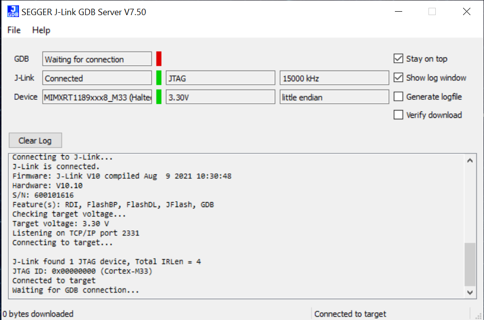
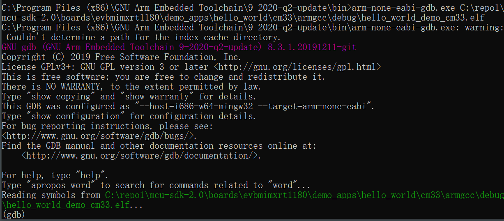

# Run an example application {#GUID-88EFC3FB-5011-47DD-9794-06A664232087}

This section describes steps to run a demo application using J-Link GDB Server application. To perform this exercise, make sure that a standalone J-Link pod is connected to the debug interface of your board.

After the J-Link interface is configured and connected, follow these steps to download and run the demo applications:

1.  This board supports the J-Link debug probe. Before using it, install SEGGER software, which can be downloaded from [SEGGER](http://www.segger.com/).
2.  Connect the development platform to your PC via USB cable between the OpenSDA USB connector and the PC USB connector.
3.  Open the terminal application on the PC, such as PuTTY or TeraTerm, and connect to the debug serial port number \(to determine the COM port number, see [How to determine COM port](how_to_determine_com_port.md)\). Configure the terminal with these settings:

    1.  115200 or 9600 baud rate, depending on your board \(reference `BOARD_DEBUG_UART_BAUDRATE`variable in the *board.h* file\)
    2.  No parity
    3.  8 data bits
    4.  1 stop bit
     configurations")

4.  Open the J-Link GDB Server application. Go to the SEGGER install folder. For example, *C:\\Program Files\(x86\)\\SEGGER\\JLink\_Vxxx*. Open the command windows. To debug CM33, run the following command:

    ```
    JLinkGDBServer.exe -device MIMXRT1189xxx8_M33 -if SWD -speed 4000 -jlinkscriptfile <evkmimxrt1180_cm33.jlinkscript> -stayontop -ir
    ```

    To debug CM7, run the following command:

    ```
    JLinkGDBServer.exe -device MIMXRT1189xxx8_M7 -if SWD -speed 4000 -jlinkscriptfile <evkmimxrt1180_cm7.jlinkscript> -stayontop -ir
    ```

    **Note:** The supporting `jlinkscript` file can be found in *boards/evkmimxrt1180/jlinkscript*.

5.  After it is connected, the screen should resemble [Figure 2](#FIG_SEGGERJLINK).

    

6.  If not already running, open a GCC ARM Embedded tool chain command window. To launch the window, from the Windows operating system **Start menu**, go to **Programs**&gt; **GNU Tools ARM Embedded &lt;version&gt;**and select **GCC Command Prompt**.

    

7.  Change to the directory that contains the example application output. The output can be found in using one of these paths, depending on the build target selected:

    *&lt;install\_dir&gt;/boards/&lt;board\_name&gt;/&lt;example\_type&gt;/&lt;application\_name&gt;/&lt;core&gt;/armgcc/&lt;target&gt;*

    For this example, the path is:

    *&lt;install\_dir&gt;/boards/evkmimxrt1180/demo\_apps/hello\_world/&lt;core&gt;/armgcc/debug*

8.  Run the `arm-none-eabi-gdb.exe <application_name>.elf`. For this example, it is `arm-none-eabi-gdb.exe hello_world.elf`.

    

9.  Run these commands:

    ```
    target remote localhost:2331
    monitor reset
    monitor halt
    load
    ```

10. The application is now downloaded and halted at the reset vector. Execute the `continue` or `monitor go` command to start the demo application.

    The `hello_world`application is now running and a banner is displayed on the terminal. If this is not true, check your terminal settings and connections.

    


**Parent topic:**[Run a demo using Arm GCC](../topics/run_a_demo_using_arm_gcc.md)

