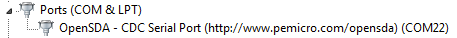
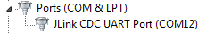

# How to determine COM port {#GUID-C30FD15B-1285-45BC-958C-7DACC3D431DA}

This section describes the steps necessary to determine the debug COM port number of your NXP hardware development platform.

1.  To determine the COM port, open the Windows operating system Device Manager. This can be achieved by going to the Windows operating system **Start** menu and typing **Device Manager** in the search bar, as shown in [Figure 1](#FIG_DEVICEMANAGER).

    

2.  In the **Device Manager**, expand the **Ports \(COM &amp; LPT\)** section to view the available ports. Depending on the NXP board you’re using, the COM port can be named differently.

    1.  OpenSDA – CMSIS-DAP/mbed/DAPLink interface:

        

    2.  OpenSDA – P&amp;E Micro:

        

    3.  OpenSDA – J-Link:

        

    4.  P&amp;E Micro OSJTAG:

        

    5.  LPC-Link2:

        

    6.  FTDI UART:

        

    7.  MCU-Link::

        

