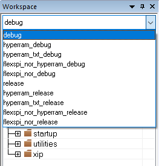
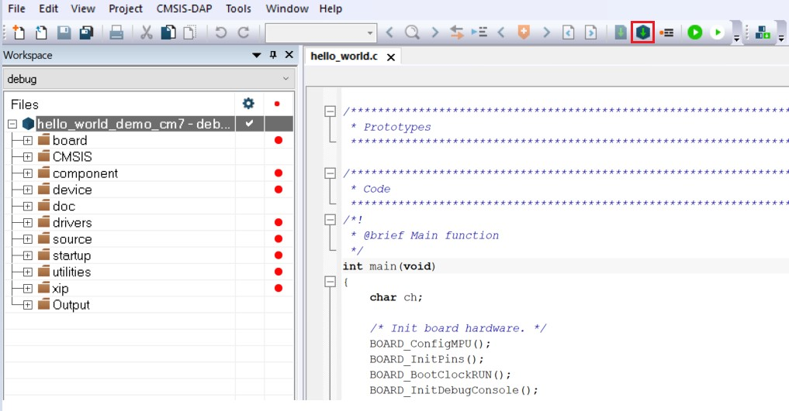

# Build an example application {#GUID-22E6D641-FA06-4447-8762-2F048FD1E063}

To build the `hello_world` demo application, perform the following steps:

1.  Open the desired demo application workspace. Most example application workspace files can be located using the following path:

    *&lt;install\_dir&gt;/boards/&lt;board\_name&gt;/&lt;example\_type&gt;/&lt;application\_name&gt;/&lt;core\_type&gt;/iar*

    Using the MIMXRT1180-EVK hardware platform as an example, the `hello_world` workspace is located in:

    *&lt;install\_dir&gt;/boards/evkmimxrt1180/demo\_apps/hello\_world/cm33/iar/hello\_world\_demo\_cm33.eww*

    Other example applications may have additional folders in their path.

2.  Select the desired build target from the drop-down menu.

    The below lists project configurations \(build targets\) supported across MCUXpresso SDK projects:

    -   `Debug` – Compiler optimization is set to low, and debug information is generated for the executable. The linker file is `RAM`linker, where text and data section is put in internal TCM.
    -   `Release` – Compiler optimization is set to high, and debug information is not generated. The linker file is `RAM` linker, where text and data section is put in internal TCM.
    -   `flexspi_nor_debug` – Project configuration is same as the debug target. The linker file is `flexspi_nor` linker, where text is put in flash and data put in TCM.
    -   `flexspi_nor_release` – Project configuration is same as the release target. The linker file is `flexspi_nor` linker, where text is put in flash and data put in TCM.
    -   `hyperram_debug` – Project configuration is same as the debug target. The linker file is HYPERRAM linker, where text is put in internal TCM and data put in HYPERRAM.
    -   `hyperram_release` – Project configuration is same as the release target. The linker file is HYPERRAM linker, where text is put in internal TCM and data put in HYPERRAM.
    -   `hyperram_txt_debug` – Project configuration is same as the debug target. The linker file is `HYPERRAM_txt` linker, where text and data section is put in HYPERRAM.
    -   `hyperram_txt_release` – Project configuration is same as the release target. The linker file is `HYPERRAM_txt` linker, where text and data section is put in HYPERRAM.
    -   `flexspi_nor_hyperram_release` - Project configuration is same as the release target. The linker file is `flexspi_nor_hyperram` linker, where text is put in flash and data put in HYPERRAM.
    -   `flexspi_nor_hyperram_debug` – Project configuration is same as the debug target. The linker file is `flexspi_nor_hyperram` linker, where text is put in flash and data put in HYPERRAM.
    For this example, select **hello\_world\_demo**– **debug**.

    

3.  To build the demo application, click Make, highlighted in red in [Figure 2](#FIG_BUILDTHEDEMOAPP).

    

4.  The build completes without errors.

**Parent topic:**[Run a demo using IAR](../topics/run_a_demo_using_iar.md)

