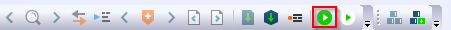
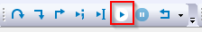
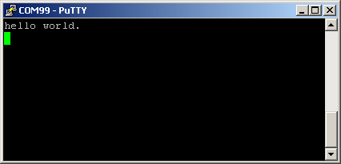

# Run an example application

The default IAR project setting assumes that CMSIS-DAP debug interface is used. When such a debug interface is used, perform the following steps to do the debugging:

1.  Connect the development platform to your PC via USB cable. Connect the USB cable to **J53** for serial output.
2.  Open the terminal application on the PC, such as PuTTY or TeraTerm, and connect to the debug COM port \(to determine the COM port number, see [How to determine COM port](how_to_determine_com_port.md)\). Configure the terminal with these settings:

    1.  115200 baud or 9600 baud rate, depending on your board \(reference `BOARD_DEBUG_UART_BAUDRATE` variable in the *board.h* file\)
    2.  No parity
    3.  8 data bits
    4.  1 stop bit
     configuration")

3.  In IAR, click the **Download and Debug** button to download the application to the target.

    

4.  The application is then downloaded to the target and automatically runs to the `main()` function.

     when running debugging")

5.  Run the code by clicking the **Go** button to start the application.

    

6.  The `hello_world` application is now running and a banner is displayed on the terminal. If the result is not true, check your terminal settings and connections.

    

**Parent topic:**[Run a demo using IAR](../topics/run_a_demo_using_iar.md)

