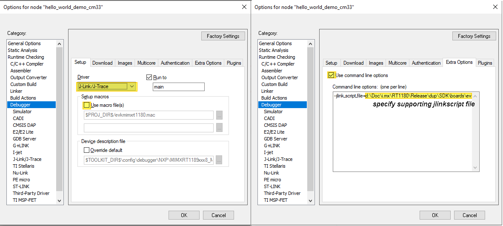

# Run applications via JLink debug interface 

When JLink Debug Interface is used, manually revise **Debug Configuration** under **Project** \> **Options** \> **Debugging**.

1.  Change the debug driver to `J-Link/J-Trace`.

2.  Uncheck **Use macro file\(s\)**.

3.  In the **Extra Options**, specify a `jlinkscript`. The `jlinkscript` files can be found in SDK package *boards/evkmimxrt1180/jlinkscript*.

    `evkmimxrt1180_cm33.jlinkscript` is for CM33 projects and `evkmimxrt1180_cm7.jlinkscript` is for CM7 projects. Use `--jlink_script_file=<full patch>` to specify it.

    

After these settings, debugging can be performed via the J-Link debugging interface.

**Note:** If IAR version is higher than or equal to 9.60.1, perform just [Step 1](#step1).

**Parent topic:**[Run a demo using IAR](../topics/run_a_demo_using_iar.md)

