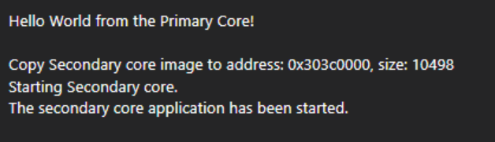

# Run a multicore example application 
This section describes the steps to run a multicore example application. The primary core debugger flashes both the primary and the auxiliary core applications into the SoC flash memory.

1.  To download and run the multicore application, switch to the primary core application project and perform Step 1 – Step 3 as described in [Build a multicore example application](keil_build_a_multicore_example_application.md).
2.  For the secondary core project, select the `Load Application at Startup` button as shown in [Figure 1](#fig_t4f_mys_31c). These steps are common for both single-core and dual-core applications in μVision.

    

3.  Run the primary core project and then run the secondary core project.

     when
                                debugging")

4.  `Hello_World` multicore demos are now running. A banner appears on the terminal and the LED D6 blinks. If this is not true, check your terminal settings and connections.

    

**Parent topic:**[Run a demo using Keil MDK/μVision](../topics/run_a_demo_using_keil_mdk_vision.md)

