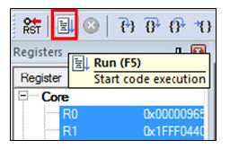
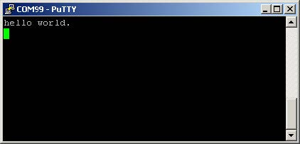

# Run an example application {#keil_run_an_example_application}

The default MDK project settings assumes CMSIS-DAP debug interface is used. If you are using a CMSIS-DAP debugging interface, perform the following steps:

1.  Connect the development platform to your PC via USB cable.
2.  Open the terminal application on the PC, such as PuTTY or TeraTerm, and connect to the debug serial port number. To determine the COM port number, see [How to determine COM port](how_to_determine_com_port.md). Configure the terminal with these settings:

    1.  115200 or 9600 baud rate, depending on your board \(reference `BOARD_DEBUG_UART_BAUDRATE`variable in the *board.h*file\)
    2.  No parity
    3.  8 data bits
    4.  1 stop bit
     configurations")

3.  To debug the application, click the **Start/Stop Debug Session** button or **Ctrl** + **F5**, highlighted in [Figure 2](#FIG_STOPATMAIN).

     when run debugging")

4.  Run the code by clicking **Run** to start the application, as shown in [Figure 3](#FIG_RUNBUTTON).

    

    The `hello_world` application is now running and a banner is displayed on the terminal, as shown in [Figure 4](#FIG_TEXTDISPLAY). If this is not true, check your terminal settings and connections.

    

**Parent topic:**[Run a demo using Keil MDK/μVision](../topics/run_a_demo_using_keil_mdk_vision.md)

