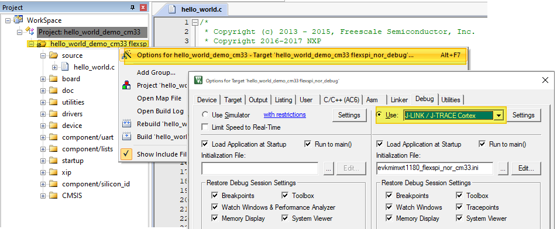
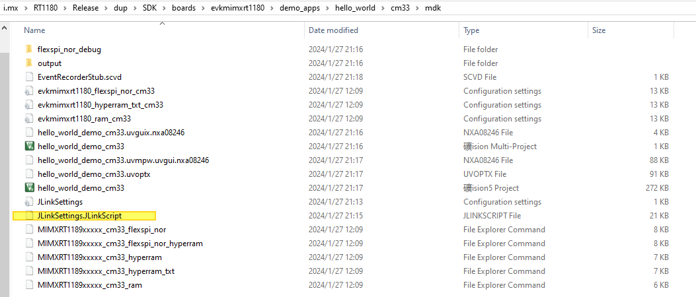

# Run applications via JLink debug interface

When JLink Debug Interface is used, manually revise **Debug Configuration**.

1.  Under **Project** \> **Options** \> **Debug**, change the debug interface to `J-LINK / J-TRACE Cortex`.

    

2.  Copy the supporting `JLinkscript` file from *boards/evkmimxrt1180/jlinkscript* to project root `dir`. For CM33 projects, use `evkmimxrt1180_cm33.jlinkscript` and for CM7 projects, use `evkmimxrt1180_cm7.jlinkscript`. Rename them to `JLinkSettings.JLinkScript`.

    

    After these settings, debugging can be performed via the J-Link debugging interface.

**Parent topic:**[Run a demo using Keil MDK/μVision](../topics/run_a_demo_using_keil_mdk_vision.md)

