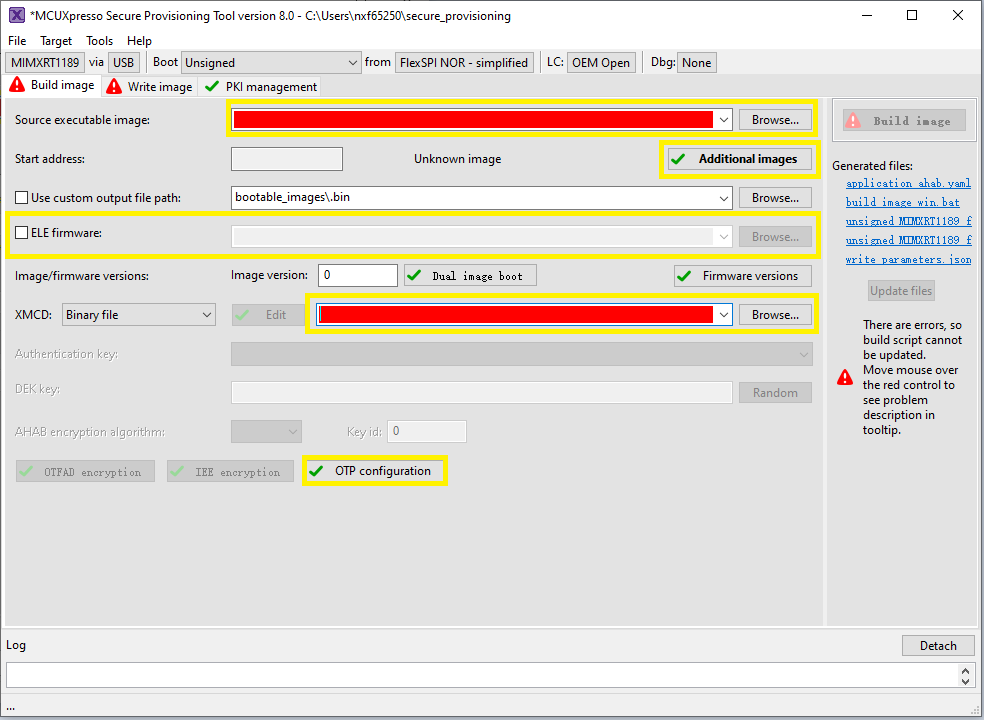

# Use SPT tool and `multicore_trigger` image to kick off `cm7` binary image {#topic_lkk_klx_g1c}

This section introduces how to create a CM7 POR boot image with the aid of a CM33 kicker application. The CM33 kicker application is located in `demo_apps/multicore_trigger`.

For a secure provisioning tool to generate such a bootable CM7 image, specify the CM33 `multicore_trigger` image in `Source executable image`. The CM7 application image to be kicked off must be specified with `additional images`.




```{include} ../topics/CM7_XIP_image_runs_from_external_FLASH.md
:heading-offset: 2
```

```{include} ../topics/CM7_binary_image_runs_from_internal_TCM.md
:heading-offset: 2
```

**Parent topic:**[Bootable image generation](../topics/bootable_image_generation.md)

