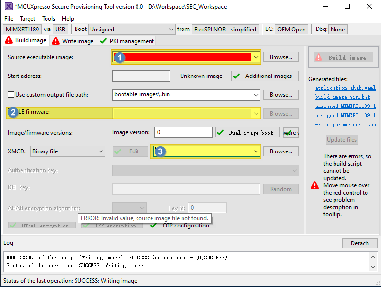
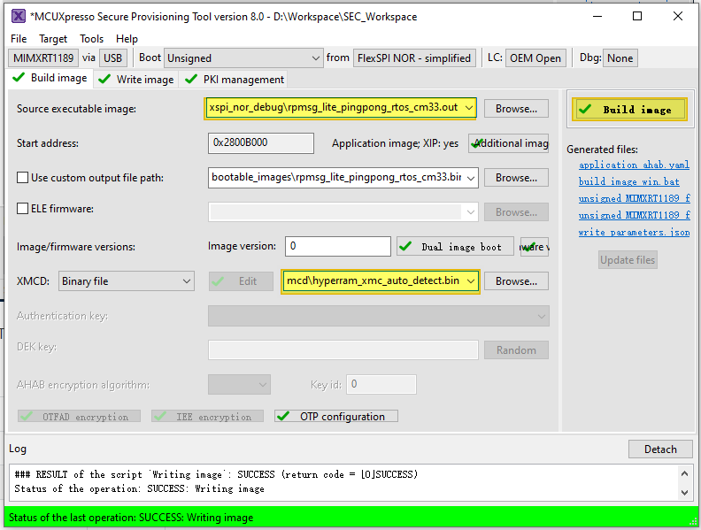
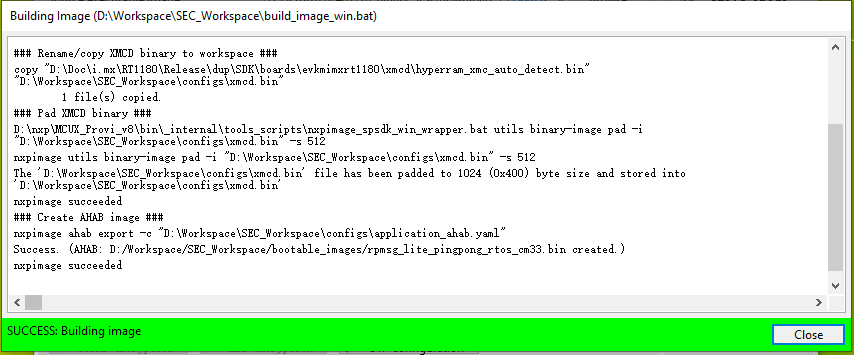
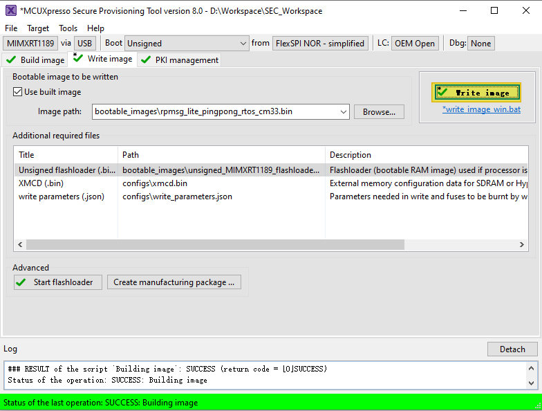
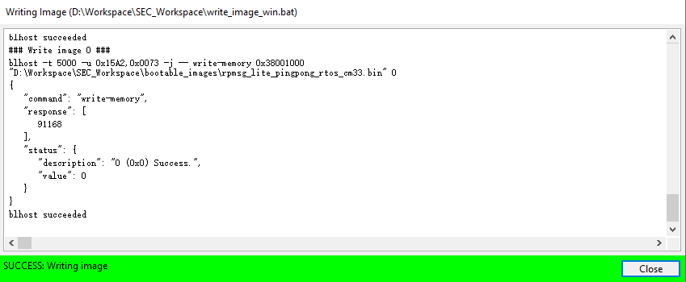

# Use SPT tool to boot cm33 image 

Run the Secure Provisioning Tool, and the following GUI shows.

Select the following items:

1.  Toolchain generated images

    All SDK generated images are supported no matter they boot from TCM, FlexSPI Nor, or HyperRAM.

    |Toolchain|Suffix|
    |---------|------|
    |ARMGCC|.elf|
    |IAR|.out|
    |MDK|.out/.hex|
    |MCUX|.axf|

    **Note:**

    -   Use the RAW image for CM33. Some SDK project targets are POR image by default, it must to be switched to RAW image for SPT usage. For more information, see [RAW/POR image switch](RAW_POR_image_switch.md).
    -   It is recommended to use elf/out files, thus SPT can parse the **Start address** automatically.
2.  XMCD file

    This is on-board SDRAM/HyperRAM initialization file. For the RT1180 EVK board, select *boards/evkmimxrt1180/xmcd/hyperram\_xmc\_auto\_detect.bin*.

    **Note:**

    -   If the application image uses `hyperram` \(target *hyperram\_debug/release*, *flexspi\_hyperram\_debug/release*, *hyperram\_txt\_debug/release*\), the XMCD is necessary.
    -   *hyperram\_xmc\_auto\_detect.bin* is board specific.
3.  \(Optional\) ELE firmware

    This is needed for certain application images which need special ELE FW service. For most SDK demos, simply leave it empty.

After the selection, click `Build Image` to generate the bootable image \(POR image\).

Now switch to the **Write Image** tab. All information is automatically generated from the previous page. Connect both USB OTG1 port \(J33\) and MCU-Link port \(J53\) to the computer and power up the board \(or reset via SW3\). Make sure that the EVK board boot configuration switch `SW5[1..4]` are on `0001` SDP mode and click **Write Image**.

Change the `SW5[1..4]` to QSPI boot mode `0100` and reset the board, and then you can observe that the image is running from POR boot.

**Parent topic:**[Bootable image generation](../topics/bootable_image_generation.md)

