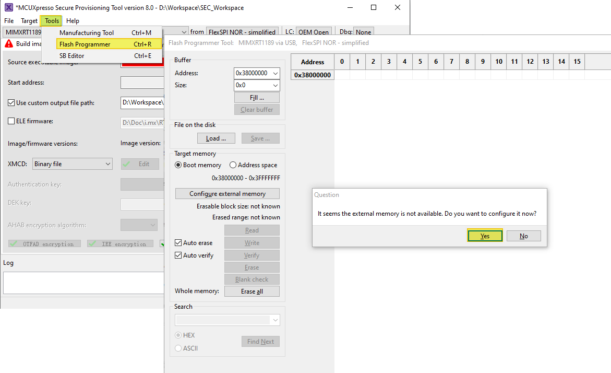
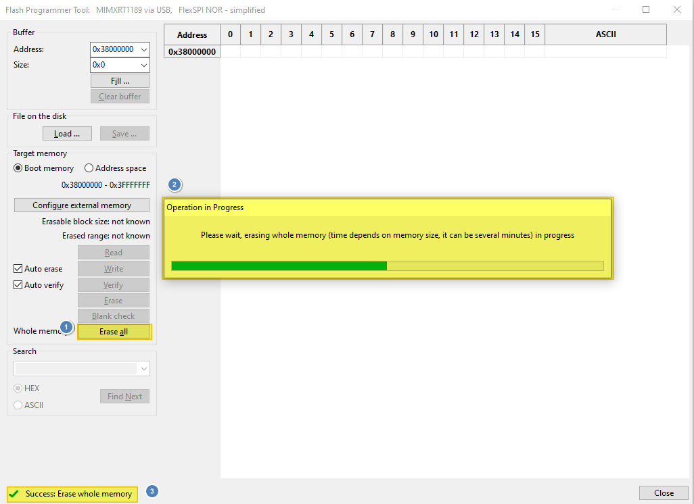

# Use Secure Provisiong Tool to erase flash {#use_secure_provisiong_tool_to_erase_flash}

In worst cases a debugger cannot successfully connect to the board. A major reason for this is there are POR boot image inside the on board flash memory which causes the whole system in a trouble state. Secure Provisioning Tool provide a reliable way to erase the flash in this worst case. To achieve this

1.  Set SW5\[1:4\] to `0001`.

2.  Connect the board to your PC from both `J53` \(Debugging\) and `J33` \(USB OTG 1\), then power up the board.

3.  Start `Secure Provisioning Tool`, select `Tool` \> `Flash Programmer` or `Ctrl + R`.

4.  Click `Yes` to prompt up questions, wait memory initialization finish.

    

5.  Click `Erase all` button and wait a minute for the erase process to finish.

    

6.  After `Success: Erase whole memory` shows up, the board should have restored to a good state to work in various mode.

**Parent topic:**[Bootable image generation](../topics/bootable_image_generation.md)

