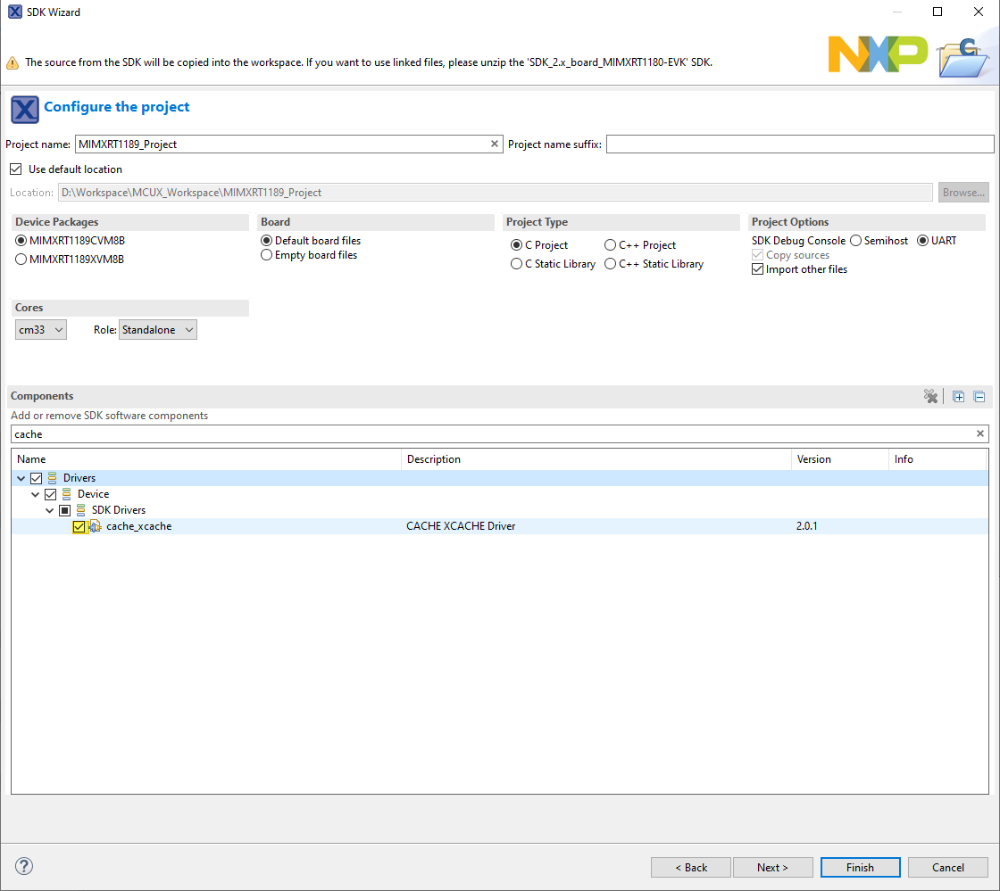

# Missing fsl\_cache when create new project with board or kit {#missing_fsl_cache_when_create_new_project_with_board_or_kit}

When creating a new C/C++ project, if `evkmimxrt1180` or `evkmimxrt1180_om13790host` kit is selected, `fsl_cache` component gets missed and causes build failure. To avoid the build failiure, manually select it in **SDK Wizard** page.

**Parent topic:**[Known issues](../topics/known_issues.md)

