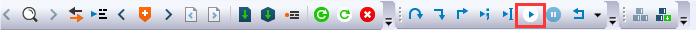

# Run a TrustZone example application

The secure project is configured to download both secure and non-secure output files, so debugging can be fully managed from the secure project. To download and run the TrustZone application, switch to the secure application project and perform steps 1 – 4 as described in *Section 4.2, Run an example application*. These steps are common for both single core, and TrustZone applications in IAR. After clicking **Download and Debug**, both the secure and non-secure images are loaded into the device memory, and the secure application is executed. It stops at the `Rest_Hander` function.

|

|

Run the code by clicking **Go** to start the application.

|

|

The TrustZone `hello_world` application is now running and a banner is displayed on the terminal. If this is not true, check your terminal settings and connections.

|

|

**Note:** If the application is running in RAM \(debug/release build target\), in **Options****\>****Debugger \> Download** tab, disable **Use flash loader\(s\)**. This can avoid the `_ns` download issue on i.MXRT500.

|")

|

**Parent topic:**[Run a demo application using IAR](../topics/run_a_demo_application_using_iar.md)

