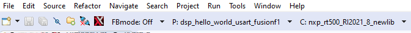

# Build the Xplorer project.

To make a build selection for the project and hardware target configuration, use the drop-down buttons on the menu bar.

|

|

**Parent topic:**[Run and Debug DSP Demo using Xplorer IDE](../topics/run_and_debug_dsp_demo_using_xplorer_ide.md)

