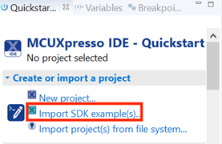
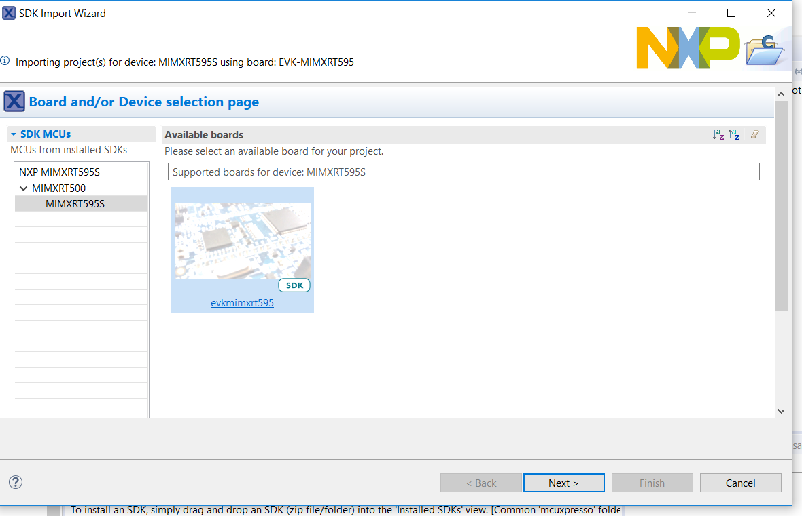
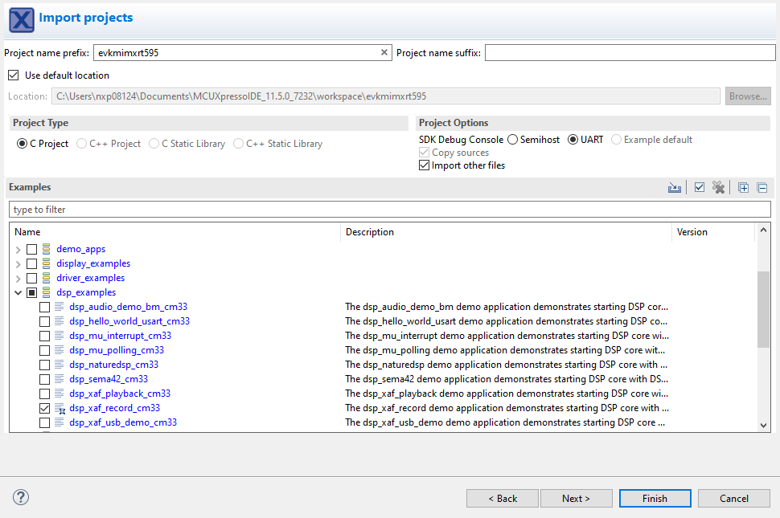
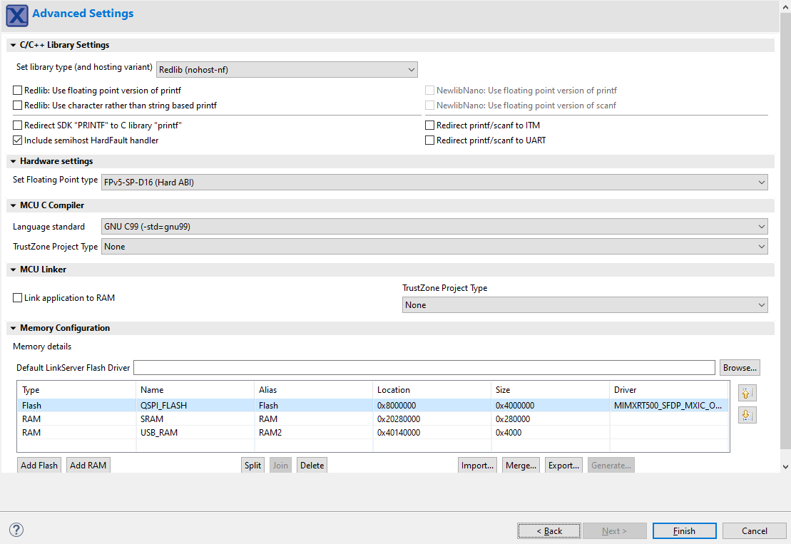
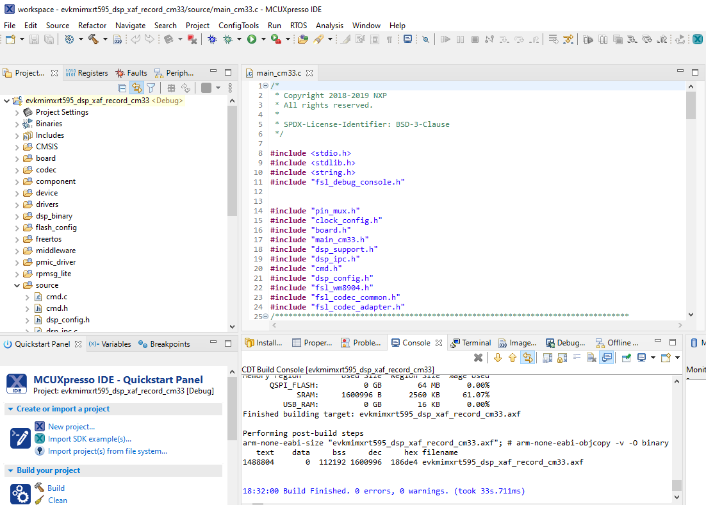
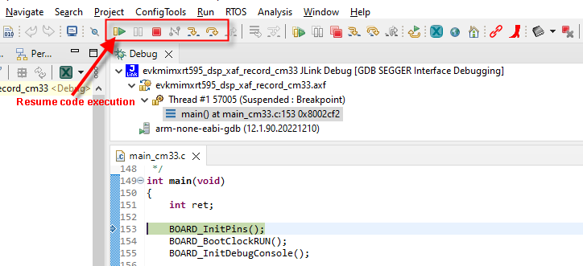
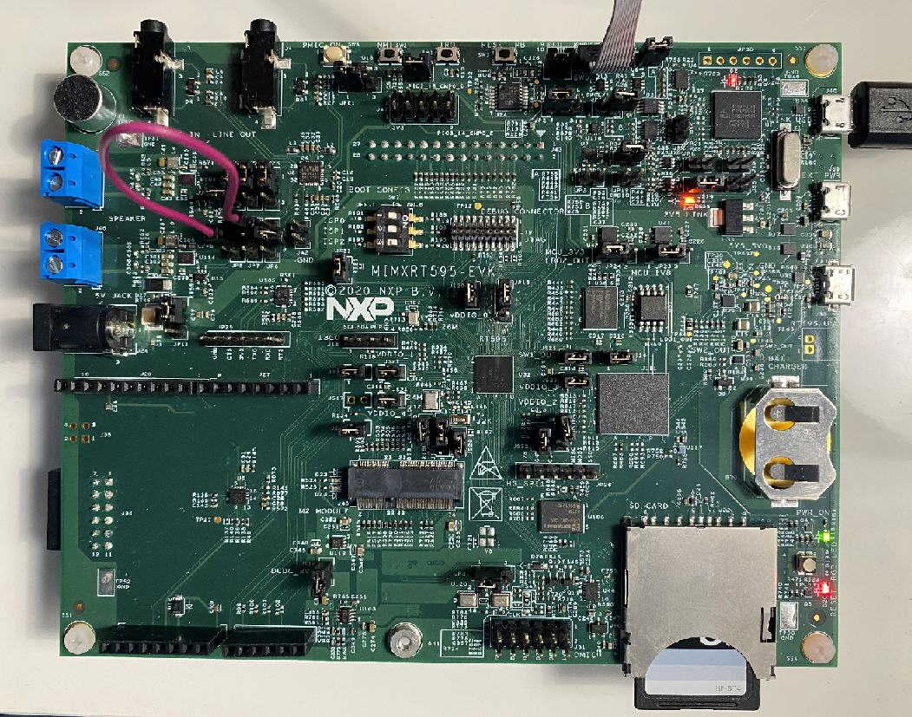

# Debug Audio Demo

To debug this DSP application, first set up, and execute the Arm application using an environment of your choosing \(see ‘Getting Started with MCUXpresso SDK for EVK-MIMXRT595.pdf’ for Arm development environment options\).

The example that follows uses NXP MCUXpresso IDE for the Arm environment.

1.  Install the MCUXpresso SDK for RT500 into the MCUXpresso IDE using the ‘Installed SDKs’ panel at the bottom:
2.  Use the QuickStart menu on the lower left of the screen to import an example from the installed SDK.

    

    

3.  Select the ‘dsp\_xaf\_record\_cm33’ example for Cortex-M33 core.
4.  Select UART in project options after clicking the dsp\_xaf\_record\_cm33 example project.

    

5.  Select ‘Finish’ to complete the import.

    

6.  Build the project and launch the debugger on success.

    

7.  Use the debug toolbar to resume the code execution.

    

8.  Observe serial terminal output with shell prompt:

    ```
    ******************************
    DSP audio framework demo start
    ******************************
    
    [CM33 Main] Configure WM8904 codec
    
    [DSP_Main] Cadence Xtensa Audio Framework
    [DSP_Main] Library Name    : Audio Framework (Hostless)
    [DSP_Main] Library Version : 3.2
    [DSP_Main] API Version     : 3.0
    
    [DSP_Main] start
    [DSP_Main] established RPMsg link
    [CM33 Main] DSP image copied to DSP TCM
    [CM33 Main][APP_DSP_IPC_Task] start
    [CM33 Main][APP_Shell_Task] start
    
    Copyright  2022  NXP
    ```

9.  In the Xplorer IDE, load and execute `xaf_record` using the procedure described in sections 3.4 and 3.5 of this document.
10. After the DSP application runs, use the serial shell to invoke the `record_dmic [language]` command. For information on supported language, check the VIT ReleaseNotes.txt. Using the serial shell creates an audio pipeline that captures microphone audio, perform voice recognition \(VIT\), and playback via the codec speaker line out \(J4 on the EVK\).

    ```
    >> help
    "help": List all the registered commands
    "exit": Exit program
    "version": Query DSP for component versions
    "record_dmic": Record DMIC audio , perform voice recognition (VIT) and playback on codec
    USAGE: record_dmic [language] 
    ```

    For voice recognition, say the supported wake-word and in 3 s say the frame-supported command. If selected model contains strings, then the wake-word and list of commands appear in the console.

    **Note:** This command does not return to the shell.

    The VIT wake-word and supported commands appear in the serial terminal.

11. See the *readme.txt* for jumper settings on the board as shown below.

    


**Parent topic:**[Run and Debug DSP Audio Framework](../topics/run_and_debug_dsp_audio_framework.md)

