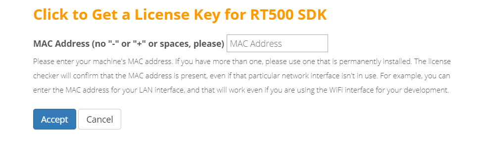
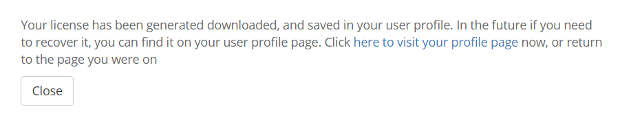
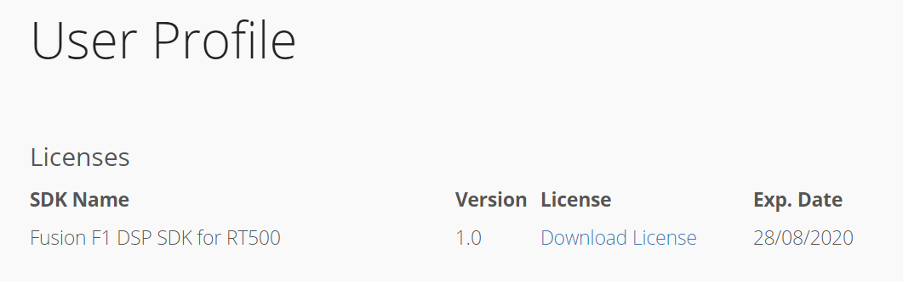

# Download License Key

To download the license key:

1.  Click the **CLICK TO GET A LICESNE KEY FOR RT500 SDK** button.

    |

|

2.  Click the **Accept** button.

    |

|

    The following message appears.

    |

|

3.  Check the license in the user-profile or the email.

    |

|

    The license file gets generated.

4.  Download the license file.
5.  Open the recently installed Xplorer V10.1.11, select menu **Help - Xplorer License Keys \> Install Software Keys**.
6.  Select the license key file.
7.  Click the **Finish** button.

    |

|

    **Note:** The generated license file only supports debug/run on the RT500 device target. It does not support software simulation/Xplorer ISS. Contact Cadence directly if you have special must run software simulations.

**Parent topic:**[Install License Key](../topics/install_license_key.md)

