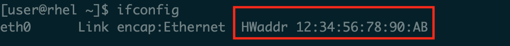

# Identify PC MAC Address

To generate the correct license file, identify the appropriate MAC for the computer you plan to run Xtensa tools on. Remove ‘-‘ or ‘:’ symbols in the MAC address.

|

|

|

|

**Note:** Linux NOTE MAC address MUST be associated with eth0 interface. If not, FLEXlm cannot perform the license checkout and you will not be able to compile or simulate you code. If your host has the MAC address associated with another interface. For example: em1, you may use the following approach, or another approach recommended by your IT team to rename the interface to eth0.

```
# Add udev rule for naming interface
$ sudo vim /etc/udev/rules.d/70-persistent-net.rules
# udev rule (replace ‘XX’ with the MAC address of your PC):
SUBSYSTEM=="net", ACTION=="add", ATTR{address}=="XX:XX:XX:XX:XX:XX", NAME="eth0"
# Change "em1" to "eth0" in your interfaces file.
$ sudo vim /etc/network/interfaces
# Restart udev or reboot machine
$ sudo reboot
```

**Parent topic:**[Install License Key](../topics/install_license_key.md)

