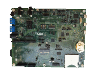

.. _evkmimxrt595:

EVK-MIMXRT595
####################

Overview
********

The i.MX RT500 EVK (MIMXRT595-EVK) features NXPs advanced implementation of the Arm\ :sup:``\ Cortex\ :sup:``-M33 core, combined with the highly optimized Cadence\ :sup:``\ Tensilica\ :sup:``\ Fusion F1 DSP processor core. MIMXRT595-EVK supports development for the MIMXRT595, MIMXRT555 and MIMXRT533 products and its features make it ideal for portable HMI applications. The i.MX RT500 EVK can help jump start your next design with the included schematics and layout files.

MCU device and part on board is shown below:

 - Device: MIMXRT595S
 - PartNumber: MIMXRT595SFFOC

Getting Started
****************
.. toctree::
   :maxdepth: 1
   :caption: Getting Started with MCUXpresso SDK for EVK-MIMXRT595

   gettingStarted/gsindex.md
