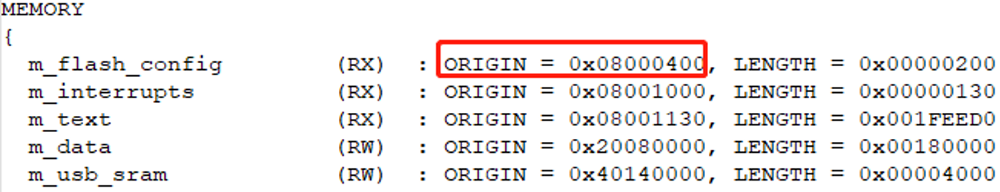

# Identify the load address of the binary

Several toolchains are supported by the MCUXpresso SDK, usually the prebuilt binaries are built from armgcc flash\_release targets using Arm GCC. If there is no flash\_release target, then release target is used.

Take hello\_world demo application as an example, the hello\_world.bin is located in:

```
<install_dir>/boards/<board_name>/<demo_apps>/hello_world/
```

And it was built from:

```
<install_dir>/boards/<board_name>/<demo_apps>/hello_world/armgcc/build_flash_release.sh
```

The load address can be identified by the linker file in the same folder. Such as <device\_name\>\_flash.ld.

|

|

So, the load address for hello\_world.bin is 0x08000400.

**Parent topic:**[Run a demo using the prebuilt binary](../topics/run_a_demo_using_the_prebuilt_binary.md)

