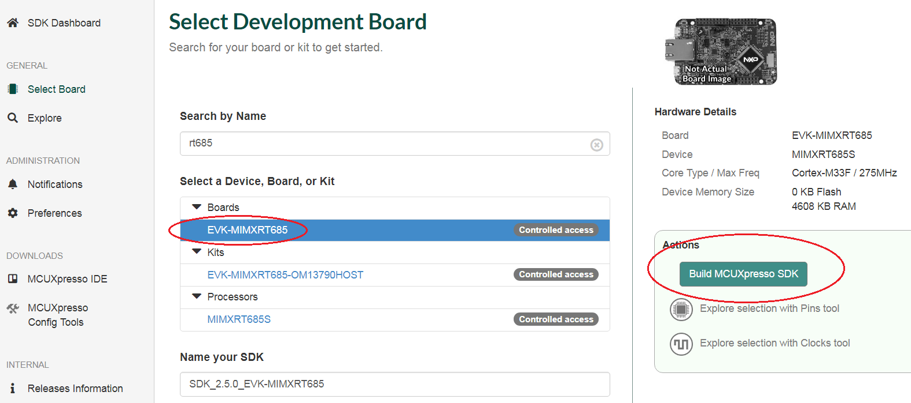

# Download MCUXpresso SDK for RT600

DSP enablement for RT600, including drivers, middleware libraries, and demo applications are included with the latest RT600 SDK available for download from [https://mcuxpresso.nxp.com](https://mcuxpresso.nxp.com/). If you are accessing the site for the first time, make sure to register.

Once logged in, perform the following steps to use the SDK builder.

1.  Click the link **Select Board /Processor** on the left panel.
2.  In the **Search by Name** field, enter the name of the board. For example, *RT685*.
3.  From the search results, select *EVK-MIMXRT685*.
4.  Click the **Build MCUXpresso SDK** button on the right panel.

    |

|

5.  In the Build SDK for EVK-MIMXRT685 page, select the required environment settings.
6.  Click the **Download SDK** button at the bottom of the page.
7.  Save the archive in a local directory.

**Parent topic:**[Install MCUXpresso SDK](../topics/install_mcuxpresso_sdk.md)

