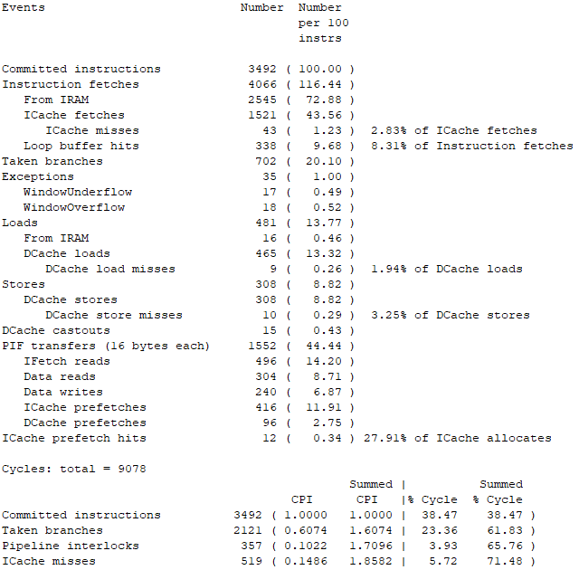
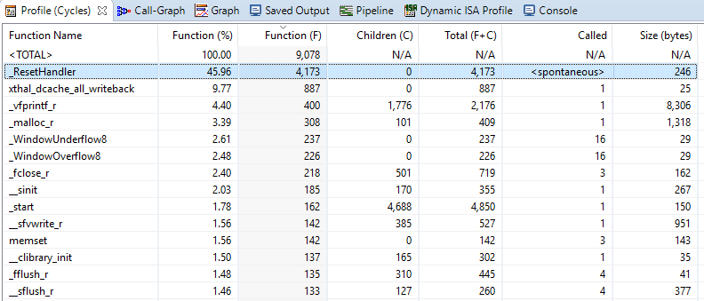

# Profiling

The Xtensa Xplorer IDE tool can run software simulation and profile the application directly. Both simulation and profiling are cycle accurate. This is convenient for algorithm or heavy application developers.

[Figure 1](profiling.md#MJDHFVWC) shows profiling result of the helloworld program on simulation console.

|

|

[Figure 1](profiling.md#MJDHFVWC) shows the profiling chart, partially.

|

|

The generated license file only supports debug/run on the RT6xx device target. It does not support software simulation/Xplorer ISS. If there are special requirements to run the software simulations, contact Cadence directly.

It is also common to measure exact cycle counts for specific processing/ timing measurements. The following is an example code to show how to do the cycle counts.

```
/* Cycle counts inline function */
static unsigned long inline get_ccount(void)
{
    unsigned long r;
    __asm__ volatile ("rsr.ccount %0" : "=r" (r));
    return r;
}
tic = get_ccount();
processing_function();
toc = get_ccount();
printf("Processing takes %d cycles \r\n", toc - tic);
```

**Parent topic:**[System Optimization](../topics/system_optimization.md)

