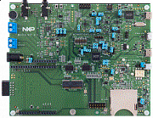

.. _evkmimxrt685:

EVK-MIMXRT685
####################

Overview
********

The NXP IMXRT685-EVKB is a development board for the i.MX RT600 Crossover MCU with Arm Cortex-M33 and DSP Cores.

MCU device and part on board is shown below:

 - Device: MIMXRT685S
 - PartNumber: MIMXRT685SFVKB

