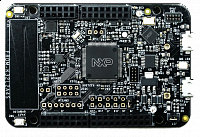

.. _frdmk32l2a4s:

FRDM-K32L2A4S
####################

Overview
********

The FRDM-K32L2A4S Freedom development platform provides an ideal board for evaluation and development of the K32 L2A MCU family based on the Arm Cortex-M0+ architecture. This platform includes an onboard debug probe, accelerometer/magnetometer, a full-speed USB and easy access to K32 L2A's MCU I/O.

The FRDM-K32L2A4S board is fully supported by the MCUXpresso suite of tools, which provides device drivers, middleware and examples to allow rapid development, plus configuration and an optional free of charge IDE.

MCU device and part on board is shown below:

 - Device: K32L2A41A
 - PartNumber: K32L2A41VLL1A

