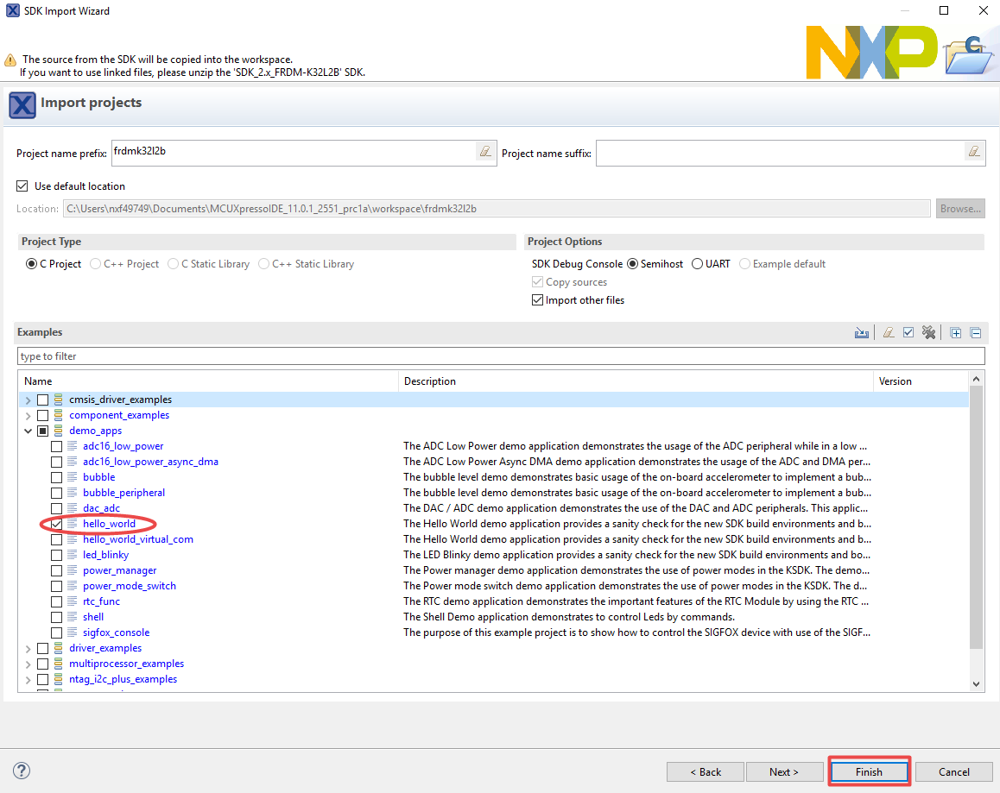
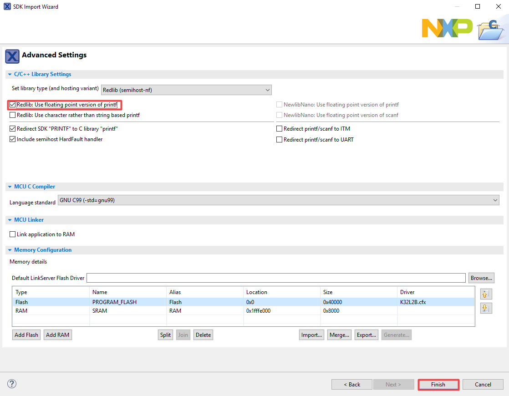

# Build an example application

To build an example application, follow these steps.

1.  Drag and drop the SDK zip file into the **Installed SDKs** view to install an SDK. In the window that appears, click **OK** and wait until the import has finished.

    

2.  On the **Quickstart Panel**, click **Import SDK example\(s\)…**.

    

3.  In the window that appears, expand the **K32L2Bx** folder and select **K32L2B31xxxA**. Then, select **frdmk32l2b** and click **Next**.

    

4.  Expand the **demo\_apps** folder and select **hello\_world**. Then, click **Next**.

    

5.  Ensure the option of `Redlib: Use floating point version of printf` is selected if the cases' print floating point numbers are on the terminal for demo applications such as `adc_basic`, `adc_burst`, `adc_dma`, and `adc_interrupt`. Otherwise, it is not necessary to select this option. Then, click **Finish**.

    

**Parent topic:**[Run a demo using MCUXpresso IDE](../topics/run_a_demo_using_mcuxpresso_ide.md)

