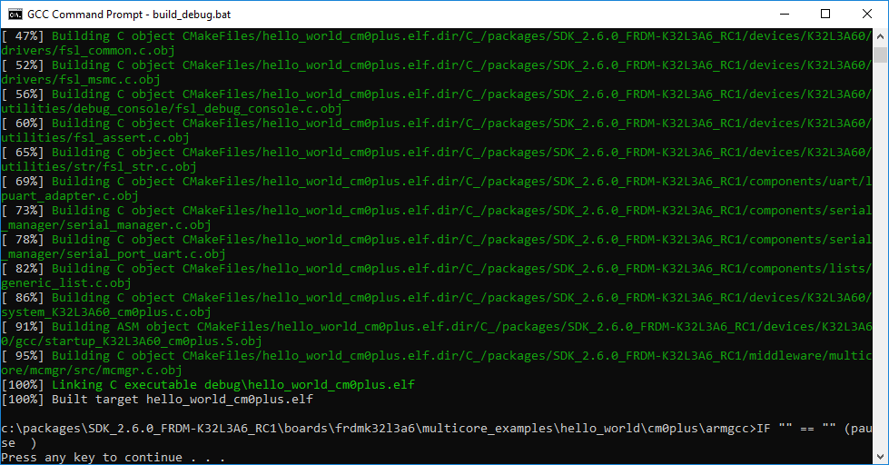
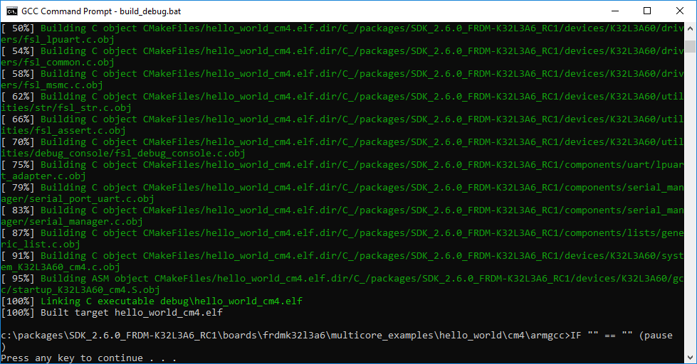

# Build a multicore example application

This section describes the steps to build and run a dual-core application. The demo application build scripts are located in this folder:

```
<install_dir>/boards/<board_name>/multicore_examples/<application_name>/<core_type>/armgcc
```

Begin with a simple dual-core version of the Hello World application. The multicore Hello World GCC build scripts are located in this folder:

```
<install_dir>/boards/frdmk32l3a6/multicore_examples/hello_world/cm0plus/armgcc/build_debug.bat
```

```
<install_dir>/boards/frdmk32l3a6/multicore_examples/hello_world/cm4/armgcc/build_debug.bat
```

Build both applications separately following steps for single core examples as described in [Build an example application](build_an_example_application_003.md#).





**Parent topic:**[Run a demo using Arm® GCC](../topics/run_a_demo_using_arm__gcc.md)

