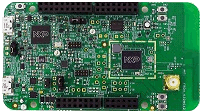

.. _frdmk32w042:

FRDM-K32W042
####################

Overview
********

The NXP FRDM-K32W042 is a development board for the Kinetis K32W032S1M2 72 MHz 32-bit ARM Cortex-M4 and ARM Cortex-M0P MCUs

MCU device and part on board is shown below:

 - Device: K32W032S1M2
 - PartNumber: K32W032S1M2CAx

