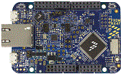

.. _frdmk64f:

FRDM-K64F
####################

Overview
********

The Freedom-K64F is an ultra-low-cost development platform for KinetisK64, K63, and K24 MCUs.

-  Form-factor compatible with the Arduino R3 pin layout
-  Peripherals enable rapid prototyping, including a 6-axis digital accelerometer and magnetometer to create full eCompass capabilities, a tri-colored LED and 2 user push-buttons for direct interaction, a microSD card slot, and connectivity using onboard Ethernet port and headers for use with Bluetoothand 2.4 GHz radio add-on modules
-  OpenSDAv2, the NXP open source hardware embedded serial and debug adapter running an open source bootloader, offers options for serial communication, flash programming, and run-control debugging

The FRDM-K64 is now supported by`ArmMbed OS <https://os.mbed.com/platforms/frdm-k64f/>`__and`Zephyr OS <https://docs.zephyrproject.org/latest/boards/arm/frdm_k64f/doc/frdm_k64f.html>`__, both open source embedded operating systems for developing the Internet of Things.

MCU device and part on board is shown below:

 - Device: MK64F12
 - PartNumber: MK64FN1M0VLL12

