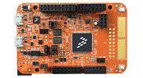

.. _frdmk82f:

FRDM-K82F
####################

Overview
********

The NXP Freedom K82F is an low-cost development platform for Kinetis K82, K81, and K80 MCUs.Form-factor compatible with the Arduino R3 pin layout.Peripherals enable rapid prototyping, including a six-axis digital accelerometer and magnetometer to create full eCompass capabilities, a tri-colored LED and two user push-buttons for direct interaction, 2x32Mb QuadSPI external flash, FlexIO camera header, touch pads and headers for use with Bluetooth and 2.4 GHz radio add-on modules.OpenSDAv2.1, the NXP open source hardware embedded serial and debug adapter running an open source bootloader, offers options for serial communication, flash programming, and run-control debugging.

MCU device and part on board is shown below:

 - Device: MK82F25615
 - PartNumber: MK82FN256VLL15

