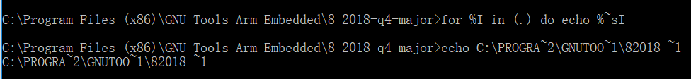

# Add a new system environment variable for ARMGCC\_DIR {#GUID-44723F41-E7EC-4A4B-8006-342C47C73A02}

Create a new *system* environment variable and name it as `ARMGCC_DIR`. The value of this variable should point to the Arm GCC Embedded tool chain installation path. For this example, the path is:

```
C:\Program Files (x86)\GNU Tools  Arm Embedded\8 2018-q4-major
```

See the installation folder of the GNU Arm GCC Embedded tools for the exact path name of your installation.

Short path should be used for path setting, you could convert the path to short path by running command `for %I in (.) do echo %~sI` in above path.

|

|

|

|

**Parent topic:**[Set up toolchain](../topics/set_up_toolchain.md)

