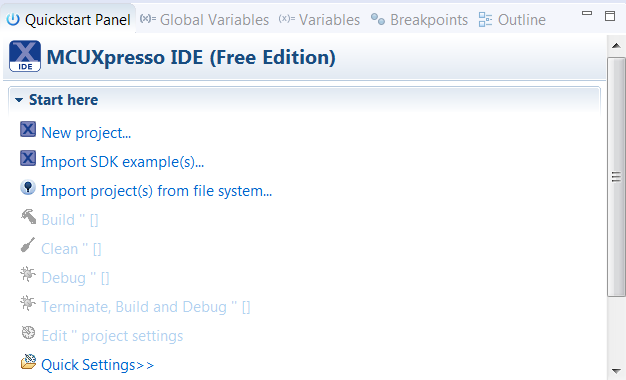

# MCUXpresso IDE New Project Wizard

MCUXpresso IDE features a new project wizard. The wizard provides functionality for the user to create new projects from the installed SDKs \(and from pre-installed part support\). It offers user the flexibility to select and change multiple builds. The wizard also includes a library and provides source code options. The source code is organized as software components, categorized as drivers, utilities, and middleware.

To use the wizard, start the MCUXpresso IDE. This is located in the **QuickStart Panel** at the bottom left of the MCUXpresso IDE window. Select **New project**, as shown in [Figure 1](mcuxpresso_ide_new_project_wizard.md#FIG_IDEQSPANEL).

|

|

For more details and usage of new project wizard, see the *MCUXpresso\_IDE\_User\_Guide.pdf* in the MCUXpresso IDE installation folder.

