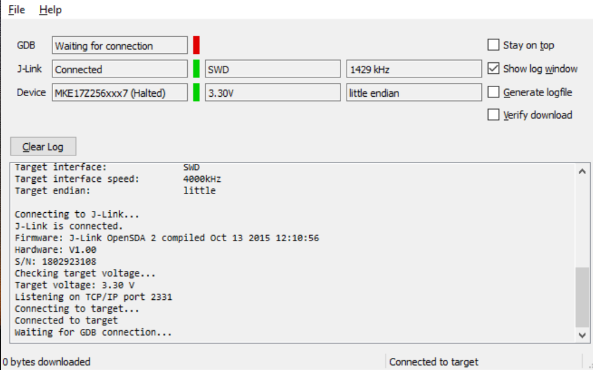
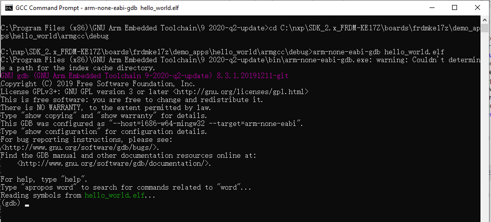

# Run an example application {#GUID-CF73F817-C428-418F-AAB9-514DC81ED047}

This section describes steps to run a demo application using J-Link GDB Server application.

To complete the set-up, check if your board supports OpenSDA in [Default debug interfaces](default_debug_interfaces.md).

If your board supports OpenSDA,

-   The OpenSDA interface on your board is pre-programmed with the J-Link OpenSDA firmware.
-   For instructions on reprogramming the OpenSDA interface, see [Updating OpenSDA firmware](updating_opensda_firmware.md).

After the J-Link interface is configured and connected, follow these steps to download and run the demo applications:

1.  Connect the development platform to your PC via USB cable between the OpenSDA USB connector and the PC USB connector. If using a standalone J-Link debug pod, connect it to the SWD/JTAG connector of the board.
2.  Open the terminal application on the PC, such as PuTTY or TeraTerm, and connect to the debug serial port number \(to determine the COM port number, see [How to determine COM port](how_to_determine_com_port.md)\). Configure the terminal with these settings:

    1.  115200 or 9600 baud rate, depending on your board \(reference `BOARD_DEBUG_UART_BAUDRATE` variable in `board.h` file\)
    2.  No parity
    3.  8 data bits
    4.  1 stop bit
    | configurations")

|

3.  Open the J-Link GDB Server application. Assuming the J-Link software is installed, launch the application by going to the Windows operating system **Start** menu and select **Programs** → **SEGGER** → **J-LINK <version\>** -\> **J-LINK GDB Server**.
4.  After it is connected, the screen looks like [Figure 2](run_an_example_application.md#FIG_SEGGERJLINK).

    |

|

5.  If not already running, open a GCC Arm Embedded tool chain command window. To launch the window, from the Windows operating system **Start** menu, go to **Programs** -\> **GNU Tools Arm Embedded <version\>** and select **GCC Command Prompt**.

    |

|

6.  Change to the directory that contains the example application output. The output can be found in using one of these paths, depending on the build target selected:

    ```
    <install_dir>/boards/<board_name>/<example_type>/<application_name>/armgcc/debug
    ```

    ```
    <install_dir>/boards/<board_name>/<example_type>/<application_name>/armgcc/release
    ```

    For this example, the path is:

    ```
    <install_dir>/boards/frdmke17z/demo_apps/hello_world/armgcc/debug
    ```

7.  Run the `arm-none-eabi-gdb.exe <application_name>.elf` command. For this example, it is `arm-none-eabi-gdb.exe hello_world.elf`.

    |

|

8.  Run these commands:
    1.  `target remote localhost:2331`
    2.  `monitor reset`
    3.  `monitor halt`
    4.  `load`
9.  The application is now downloaded and halted at the watch point. Execute the `monitor go` command to start the demo application.

    The `hello_world` application is now running and a banner is displayed on the terminal. If this does not appear, check your terminal settings and connections.

    |

|


**Parent topic:**[Run a demo using Arm® GCC](../topics/run_a_demo_using_arm__gcc.md)

