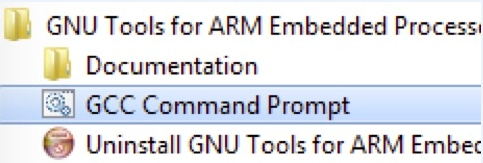

# Build an example application {#armgcc_build_an_example_application}

To build an example application, follow these steps.

1.  Open a GCC Arm Embedded tool chain command window. To launch the window, from the Windows operating system **Start** menu, go to **Programs** -\>**GNU Tools Arm Embedded <version\>** and select **GCC Command Prompt**.

    

2.  Change the directory to the example application project directory which has a path similar to the following:

    *<install\_dir\>/boards/<board\_name\>/<example\_type\>/<application\_name\>/armgcc*

    For this example, the exact path is:

    *<install\_dir\>/boards/frdmke17z/demo\_apps/hello\_world/armgcc*

    **Note:** To change directories, use the `cd` command.

3.  Type **build\_debug.bat** on the command line or double click the *build\_debug.bat* file in Windows Explorer to build it. The *hello\_world.elf* file is generated under *.\\debug* folder.

**Parent topic:**[Run a demo using Arm GCC](../topics/run_a_demo_using_arm_gcc.md)

