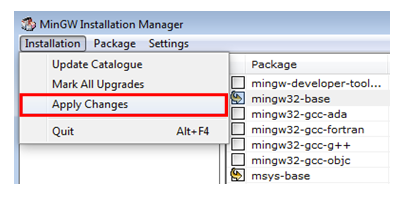
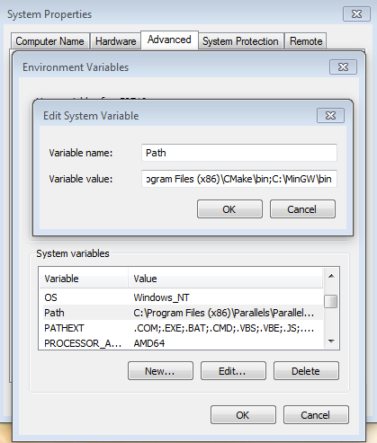

# Install MinGW \(only required on Windows OS\) {#armgcc_install_mingw_only_required_on_windows_os}

The Minimalist GNU for Windows \(MinGW\) development tools provide a set of tools that are not dependent on third-party C-Runtime DLLs \(such as Cygwin\). The build environment used by the MCUXpresso SDK does not use the MinGW build tools, but does leverage the base install of both MinGW and MSYS. MSYS provides a basic shell with a Unix-like interface and tools.

1.  Download the latest MinGW mingw-get-setup installer from [MinGW](http://sourceforge.net/projects/mingw/files/Installer/).
2.  Run the installer. The recommended installation path is `C:\MinGW`, however, you may install to any location.

    **Note:** The installation path cannot contain any spaces.

3.  Ensure that the **mingw32-base** and **msys-base** are selected under **Basic Setup**.

    

4.  In the **Installation** menu, click **Apply Changes** and follow the remaining instructions to complete the installation.

    

5.  Add the appropriate item to the Windows operating system path environment variable. It can be found under **Control Panel** -\> **System and Security** -\> **System** -\> **Advanced System Settings** in the **Environment Variables...** section. The path is:

    *<mingw\_install\_dir\>\\bin*

    Assuming the default installation path, `C:\MinGW`, an example is as shown in [Figure 3](#FIG_ADDPATH). If the path is not set correctly, the toolchain will not work.

    **Note:** If you have `C:\MinGW\msys\x.x\bin` in your PATH variable \(as required by Kinetis SDK 1.0.0\), remove it to ensure that the new GCC build system works correctly.

    

**Parent topic:**[Set up toolchain](../topics/armgcc_set_up_toolchain.md)

