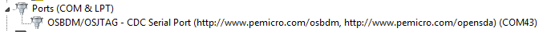

# How to determine COM port 

This section describes the steps necessary to determine the debug COM port number of your NXP hardware development platform.

1.  **Linux**: The serial port can be determined by running the following command after the USB Serial is connected to the host:

    ```
    $ dmesg | grep "ttyUSB"
                        [503175.307873] usb 3-12: cp210x converter now attached to ttyUSB0
                        [503175.309372] usb 3-12: cp210x converter now attached to ttyUSB1
    ```

    There are two ports: one is Cortex-A core debug console and the other is for Cortex M4.

2.  **Windows**: To determine the COM port open Device Manager in the Windows operating system. Click on the **Start** menu and type **Device Manager** in the search bar.

3.  In the Device Manager, expand the **Ports \(COM & LPT\)** section to view the available ports. The COM port names will be different for all the NXP boards.

    1.  **OpenSDA – CMSIS-DAP/mbed/DAPLink** interface:

        

    2.  **OpenSDA – P&E Micro**:

        

    3.  **OpenSDA – J-Link**:

        

    4.  **P&E Micro OSJTAG**:

        

    5.  **MRB-KW01**:

        


