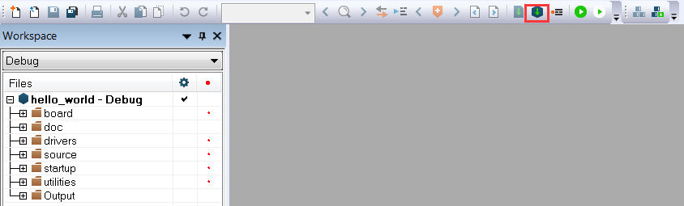

# Build an example application 

Perform the following steps to build the `hello_world` example application.

1.  Open the desired demo application workspace. Most example application workspace files can be located using the following path:

    *<install\_dir\>/boards/<board\_name\>/<example\_type\>/<application\_name\>/iar*

    Using the FRDM-KE17Z512 Freedom hardware platform as an example, the `hello_world` workspace is located in:

    *<install\_dir\>/boards/frdmke17z512/demo\_apps/hello\_world/iar/hello\_world.eww*

    Other example applications may have additional folders in their path.

2.  Select the desired build target from the drop-down menu.

    For this example, select **hello\_world** – **debug**.

    

3.  To build the demo application, click **Make**, highlighted in red in [Figure 2](#FIG_BUILDINGDEMOAPP).

    

4.  The build completes without errors.

**Parent topic:**[Run a demo application using IAR](../topics/run_a_demo_application_using_iar.md)

