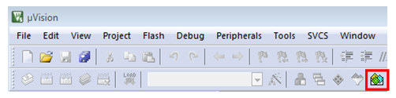

# Install CMSIS device pack {#keil_install_cmsis_device_pack}

After the MDK tools are installed, Cortex Microcontroller Software Interface Standard \(CMSIS\) device packs must be installed to fully support the device from a debug perspective. These packs include things such as memory map information, register definitions, and flash programming algorithms. Follow these steps to install the appropriate CMSIS pack.

1.  Open the MDK IDE, which is called μVision. In the IDE, select the **Pack Installer** icon.

    

2.  After the installation finishes, close the Pack Installer window and return to the μVision IDE.

**Parent topic:**[Run a demo using Keil MDK/μVision](../topics/run_a_demo_using_keil_mdk_vision.md)

