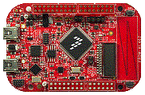

.. _frdmkl46z:

FRDM-KL46Z
####################

Overview
********

The Freedom KL46Z is an ultra-low-cost development platform enabled by the Kinetis L series KL4x MCU family built on the ARM Cortex-M0+ processor.

MCU device and part on board is shown below:

 - Device: MKL46Z4
 - PartNumber: MKL46Z256VLL4

