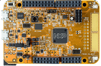

.. _frdmkl82z:

FRDM-KL82Z
####################

Overview
********

The FRDM-KL82Z supports a power supply voltage range of 1.71 to 3.6 V. It features a KL82Z, a device boasting up to 128 KB flash and 96 KB SRAM, and numerous analog and digital peripherals. In addition, the FRDM-KL82Z offers a QSPI interface to expand program memory and USB 2.0 Full Speed without requiring an external crystal.

MCU device and part on board is shown below:

 - Device: MKL82Z7
 - PartNumber: MKL82Z128VLK7

