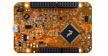

.. _frdmkv31f:

FRDM-KV31F
####################

Overview
********

The FRDM-KV31F is a low-cost development tool for the Kinetis V series KV3x MCU family built on the ARM Cortex-M4 processor. The FRDM-KV31F hardware is form-factor compatible with the Arduino R3 pin layout, providing a broad range of expansion board options, including FRDM-MC-LVPMSM and FRDM-MC-LVBLDC for permanent magnet and brushless DC motor control.The FRDM-KV31F platform features OpenSDA, the NXP open source hardware embedded serial and debug adapter running an open source bootloader. This circuit offers several options for serial communication, flash programming, and run-control debugging. The FRDM-KV31F is supported by a range of NXP and third-party development software.The FRDM-KV31F is the first device in the Kinetis V portfolio to be enabled with Kinetis Motor Suite (KMS). Kinetis Motor Suite (KMS) is a software solution that enables the rapid configuration of motor drive systems, accelerates development of the final motor drive application whilst improving overall motor system performance due to its unique SpinTAC enabled speed controller. Tuning and optimization is carried out via a simple graphical user interface that enables a developer to easily identify their motor, tune that motor using just one control dial and build a state machine to control the various speed transitions of the motor. For more information go to nxp.com/kms.

MCU device and part on board is shown below:

 - Device: MKV31F51212
 - PartNumber: MKV31F512VLL12

