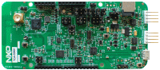

.. _frdmkw36:

FRDM-KW36
####################

Overview
********

The KW36Z devices, which include both Automotive and Industrial devices, are highly integrated single-chip devices that enable Bluetooth low energy (BLE) and Generic FSK connectivity for automotive and industrial embedded systems. The applications center on bridging the embedded world with smartphones to enhance the human interface experience, share embedded data with the cloud, or enable wireless firmware updates. The KW36Z MCU integrates a 2.4 GHz transceiv operating in the 2.36GHz to 2.48GHz range supporting a range of Generic FSK, an ARM Cortex-M0+ CPU, up to 256 KB Flash, up to 256 KB FlexNVM and up to 64 KB SRAM, BLE Link Layer hardware and Generic FSK Link layer controller hardware and peripherals optimized to meet the requirements of the target applications. The BLE transceiver supports up to 8 concurrent connections in any master-slave combination.

MCU device and part on board is shown below:

 - Device: MKW36Z4
 - PartNumber: MKW36Z512VHT4

