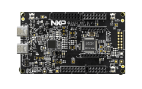

.. _frdmmcxa153:

FRDM-MCXA153
####################

Overview
********

| The NXP FRDM-MCXA153 is a development board for the A153 96 MHz Arm Cortex-M33 microcontroller.

MCU device and part on board is shown below:

 - Device: MCXA153
 - PartNumber: MCXA153VLH

Getting Started
****************
.. toctree::
   :maxdepth: 1
   :caption: Getting Started with MCUXpresso SDK for FRDM-MCXA153

   ../commongs/gettingStarted/gsindex.md
