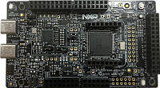

.. _frdmmcxa156:

FRDM-MCXA156
####################

Overview
********

| The NXP FRDM-MCXA156 is a development board for the A15X/A14X 96 MHz Arm Cortex-M33 microcontroller.

MCU device and part on board is shown below:

 - Device: MCXA156
 - PartNumber: MCXA156VLL

Getting Started
****************
.. toctree::
   :maxdepth: 1
   :caption: Getting Started with MCUXpresso SDK for FRDM-MCXA156

   ../commongs/gettingStarted/gsindex.md
