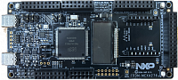

.. _frdmmcxa276:

FRDM-MCXA276
####################

Overview
********

The FRDM-MCXA276 board is a design and evaluation platform based on the NXP MCXA276 microcontroller
(MCU). The MCXA276 MCU is a low-power microcontroller for industrial and consumer Internet of Things
(IoT) applications. It has one Arm Cortex-M33 core running at speeds of up to 180 MHz. It supports industrial
communication protocol, brushless direct current (BLDC) motor / permanent magnet synchronous motor
(PMSM) control, and integrated sensor interfaces (I3C, I2C, and SPI).

The board is compatible with Arduino boards (Arduino UNO R3 and Arduino A4/A5), motor control boards
(FRDM-MC-LVBLDC and FRDM-MC-LVPMSM), Mikroe click boards, and Pmod boards. It can be used with a
wide range of development tools, including NXP MCUXpresso IDE, IAR Embedded Workbench, and Arm Keil
MDK. The board is lead-free and RoHS-compliant.

For debugging the MCXA276 MCU, the FRDM-MCXA276 board uses an onboard (OB) debug probe, MCU-Link
OB, which is based on another NXP MCU: LPC55S69

MCU device and part on board is shown below:

 - Device: MCXA276
 - PartNumber: MCXA276VLQ

Getting Started
****************
.. toctree::
   :maxdepth: 1
   :caption: Getting Started with MCUXpresso SDK for FRDM-MCXA276

   ../commongs/gettingStarted/gsindex.md