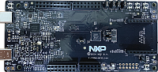

.. _frdmmcxl144:

FRDM-MCXL144
####################

Overview
********

The NXP FRDM-MCXL144 is a development board for the L14X 40 MHz Arm Cortex-M33 microcontroller.

` <https://mir.nxp.com/log/record?refType=board&amp;refId=217&amp;column=overview>`__

MCU device and part on board is shown below:

 - Device: MCXL144
 - PartNumber: MCXL144VPJ

