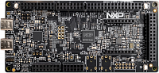

.. _frdmmcxn236:

FRDM-MCXN236
####################

Overview
********

| The NXP FRDM-MCXN236 is a development board for the N23x 150 MHz Arm Cortex-M33 TrustZone microcontroller, which is for Industrial and Consumer IoT Applications.

MCU device and part on board is shown below:

 - Device: MCXN236
 - PartNumber: MCXN236VDF

Getting Started
****************
.. toctree::
   :maxdepth: 1
   :caption: Getting Started with MCUXpresso SDK for FRDM-MCXN236

   ../commongs/gettingStarted/gsindex.md
