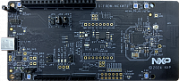

.. _frdmmcxw7x:

FRDM-MCXW7X
####################

Overview
********

| The NXP FRDM-MCXW71 is a development board for the MCXW71 96 MHz Arm Cortex-M33 microcontroller.

MCU device and part on board is shown below:

 - Device: MCXW716C
 - PartNumber: MCXW716CMFTA

