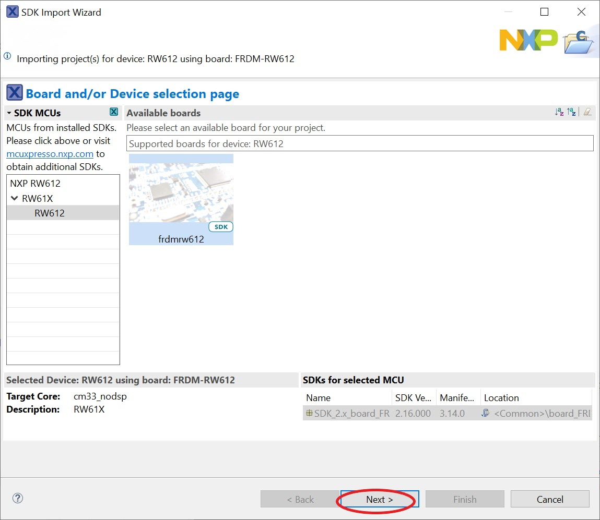
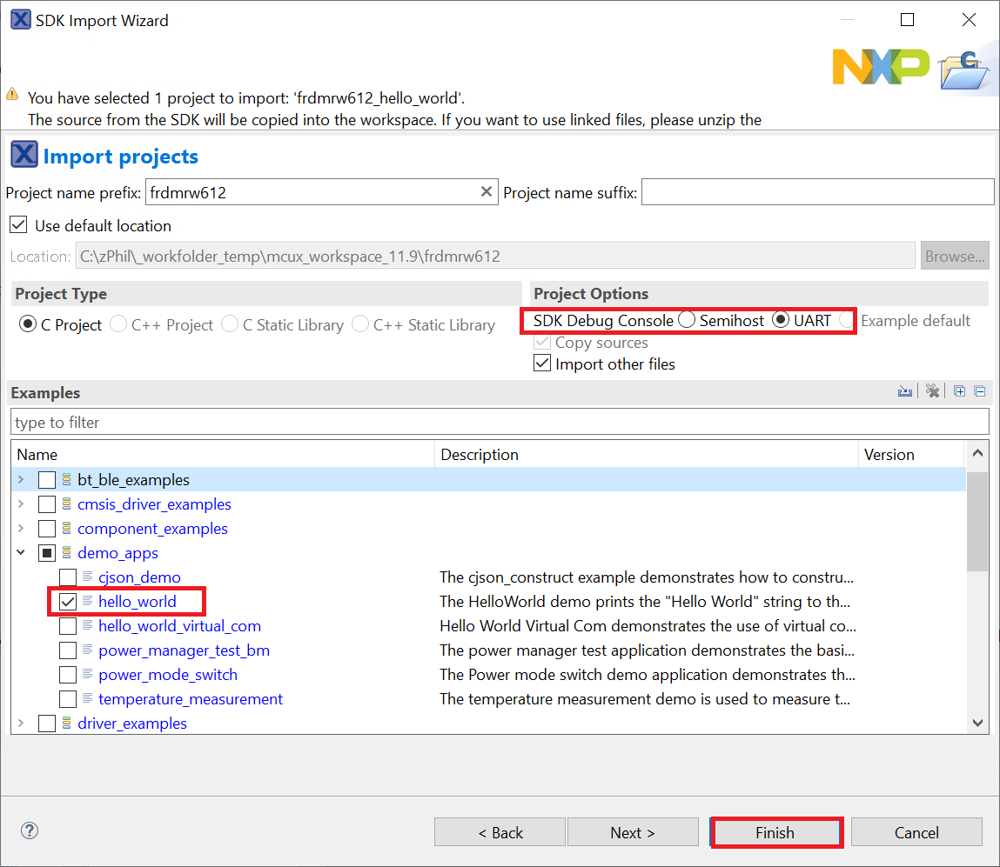

# Build an example application

To build an example application, follow these steps.

1.  Drag and drop the SDK zip file into the **Installed SDKs** view to install an SDK. In the window that appears, click **OK** and wait until the import has finished.

    |

|

2.  On the **Quickstart Panel**, click **Import SDK example\(s\)…**.

    |

|

3.  In the window that appears, expand the **RW61X** folder and select **RW612**.

4.  Select **frdmrw612** and click **Next**.

    |

|

5.  Expand the `demo_apps` folder and select `hello_world` . Then, click **Next** .

    |

|

6.  Ensure **Redlib: Use floating point version of printf** is selected if the example prints floating point numbers on the terminal. Otherwise, it is not necessary to select this option. Then, click **Finish**.

    |

|

**Parent topic:**[Run a demo using MCUXpresso IDE](../topics/run_a_demo_using_mcuxpresso_ide.md)

