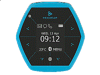

.. _hexiwear:

HEXIWEAR
####################

Overview
********

Hexiwear platform combines the style and usability found in high-end consumer devices, with the functionality and expandability of sophisticated engineering development platforms, making Hexiwear the ideal form factor for the IoT edge node and wearable markets. Completely open-source and developed by MikroElektronika in partnership with NXP. the Hexiwear hardware includes the low power, high performance Kinetis K6x Microcontroller based on ARM Cortex-M4 core, the Kinetis KW40Z multimode radio SoC, supporting BLE in Hexiwear. The Hardware features included 6 on-board sensors such as Optical Heart Rate Monitor, Accelerometer and Magnetometer, Gyroscope, Temperature, Humidity, light and Pressure sensors. Hexiwear also includes Color OLED Display, Rechargeable battery and External flash memory.Hexiwear is supported with its own application for Android and iOS, so customers can connect the device to the cloud straight out of the box, without any additional software development. Hexiwear uses FreeRTOS, the Kinetis software development kit (SDK) and the Kinetis Design Studio IDE.Eye-catching Smart Watch form factor with powerful, low power Kinetis K6x MCU and 6 on-board sensors.Designed for wearable applications with the onboard rechargeable battery, OLED screen and onboard sensors such as optical heart rate, accelerometer, magnetometer and gyroscope.Designed for IoT end node applications with the onboard sensors such as temperature, pressure, humidity and ambient light.Complete software solution with open source embedded software, cell phone apps and cloud connectivity. Flexibility to let you add the sensors of your choice nearly 200 additional sensors through click boards.

MCU device and part on board is shown below:

 - Device: MK64F12
 - PartNumber: MK64FN1M0VDC12

