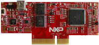

.. _hvpke18f:

HVP-KE18F
####################

Overview
********

The HVP-KE18F controller card is a development platform for the Kinetis.KE1x family that, in combination with the HVP-MC3PH high-voltage development platform, provides ready-made software and hardware development for.high-voltage motor control and power conversion applications.

MCU device and part on board is shown below:

 - Device: MKE18F16
 - PartNumber: MKE18F512VLL16

