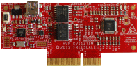

.. _hvpkv11z75m:

HVP-KV11Z75M
####################

Overview
********

The HVP-KV11Z75M controller card is a development platform for the Kinetis KV1x family that, in combination with the HVP-MC3PH high-voltage development platform, provides ready-made software and hardware development for high-voltage motor control and power conversion applications.

MCU device and part on board is shown below:

 - Device: MKV11Z7
 - PartNumber: MKV11Z128VLF7

